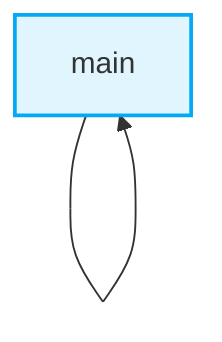

# Branch Structure for Plan: test_plan

**Current Branch:** `main`

## Branches

## Branch Visualization

```mermaid
graph TD
    main["main"]:::current
    main --> main
    classDef current fill:#e1f5fe,stroke:#03a9f4,stroke-width:2px
```