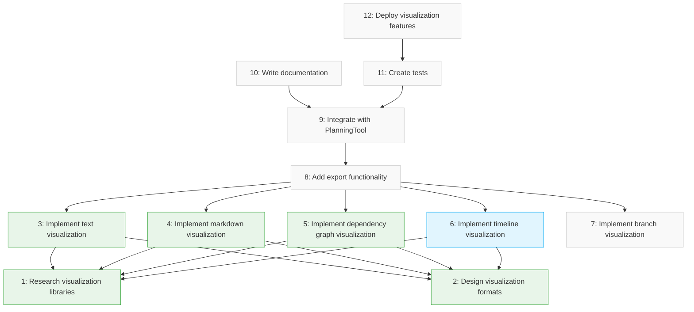

# Dependency Graph for Plan: Test Plan for Visualization

## Steps and Dependencies

| Step | Description | Dependencies | Status |
| ---- | ----------- | ------------ | ------ |
| 1 | Research visualization libraries | None | ✅ completed |
| 2 | Design visualization formats | None | ✅ completed |
| 3 | Implement text visualization | Step 1, Step 2 | ✅ completed |
| 4 | Implement markdown visualization | Step 1, Step 2 | ✅ completed |
| 5 | Implement dependency graph visualization | Step 1, Step 2 | ✅ completed |
| 6 | Implement timeline visualization | Step 1, Step 2 | 🔄 in_progress |
| 7 | Implement branch visualization | None | ⬜ not_started |
| 8 | Add export functionality | Step 3, Step 4, Step 5, Step 6, Step 7 | ⬜ not_started |
| 9 | Integrate with PlanningTool | Step 8 | ⬜ not_started |
| 10 | Write documentation | Step 9 | ⬜ not_started |
| 11 | Create tests | Step 9 | ⬜ not_started |
| 12 | Deploy visualization features | Step 11 | ⬜ not_started |

## Root Steps (No Dependencies)

- Step 10: ⬜ Write documentation
- Step 12: ⬜ Deploy visualization features

## Leaf Steps (No Dependents)

- Step 1: ✅ Research visualization libraries
- Step 2: ✅ Design visualization formats
- Step 7: ⬜ Implement branch visualization

## Dependency Graph Visualization

