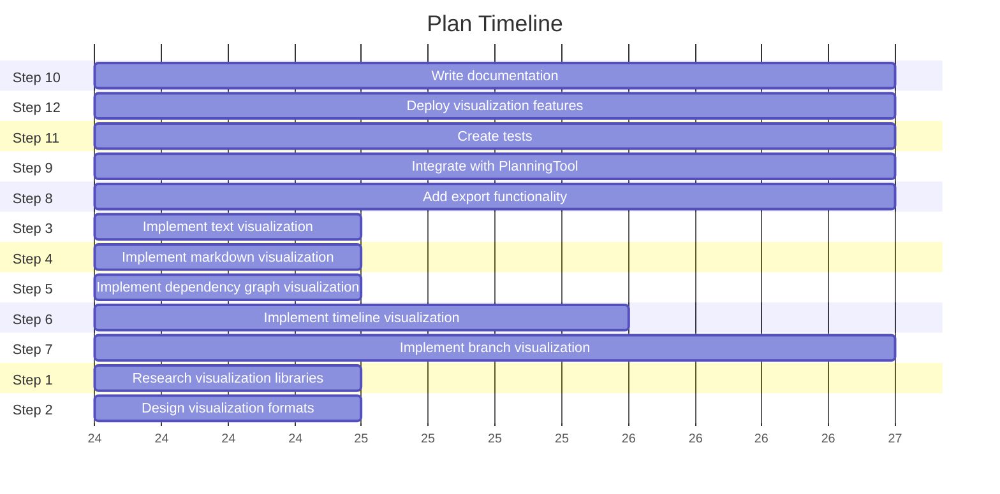

# Timeline for Plan: Test Plan for Visualization

**ID:** `test_plan`
**Created:** 2025-04-24T01:16:00.972623
**Updated:** 2025-04-24T01:16:00.973610

## Timeline

### 1. Step 10: ⬜ Write documentation

**Dependencies:** Step 9

### 2. Step 12: ⬜ Deploy visualization features

**Dependencies:** Step 11

### 3. Step 11: ⬜ Create tests

**Dependencies:** Step 9

### 4. Step 9: ⬜ Integrate with PlanningTool

**Dependencies:** Step 8

### 5. Step 8: ⬜ Add export functionality

**Dependencies:** Step 3, Step 4, Step 5, Step 6, Step 7

### 6. Step 3: ✅ Implement text visualization

**Dependencies:** Step 1, Step 2

### 7. Step 4: ✅ Implement markdown visualization

**Dependencies:** Step 1, Step 2

### 8. Step 5: ✅ Implement dependency graph visualization

**Dependencies:** Step 1, Step 2

### 9. Step 6: 🔄 Implement timeline visualization

**Dependencies:** Step 1, Step 2

### 10. Step 7: ⬜ Implement branch visualization

**Dependencies:** None

### 11. Step 1: ✅ Research visualization libraries

**Dependencies:** None

### 12. Step 2: ✅ Design visualization formats

**Dependencies:** None

## Timeline Visualization

